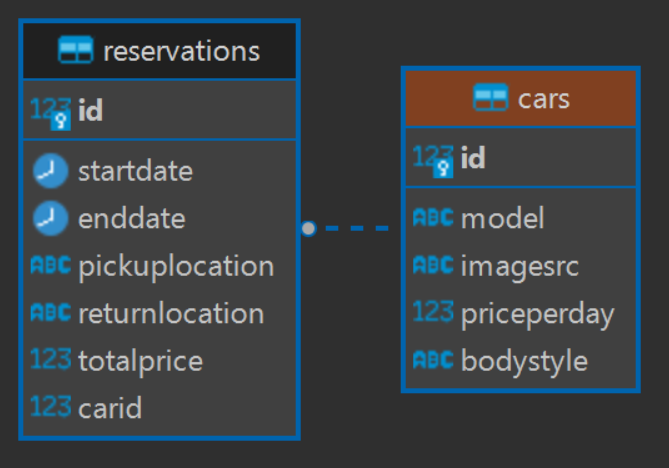

# Getting Started

This full-stack application facilitates reservations for Tesla car rentals in Mallorca. The system comprises two modules: frontend and backend, both connecting to an external PostgreSQL database. The backend is developed using .NET with the Entity Framework, while the frontend is built using Next.js, a React.js framework. Users can:

- Select parameters for the desired car
- Choose from various models based on selected parameters
- Book the selected model

Database schema:


## 1. Create PostgreSQL database

- Install postgreSQL on your machine: [link](https://www.postgresql.org/download/)
- Create database with following credentials:
  - Host=localhost;
  - Port=5432;
  - Database=[db_name];
  - Username=[your_username];
  - Password=[your_password];

## 2. Running the Backend

- Open the `car-rental-backend` directory using your IDE.
- In the `ApplicationDbContext.cs` file, update the connection string:

```
"Host=localhost;Port=5432;Database=[db_name];Username=[your_username];Password=[your_password];"

```

- Run backend server

## 3. Running the Frontend

- Add a `.env` file in the car-rental-frontend directory and define the environment variable: `BACKEND_API_URL = "http://localhost:5022/api"`.
- In the terminal, run the following commands:

  - `npm install`

  - `npm run dev`
